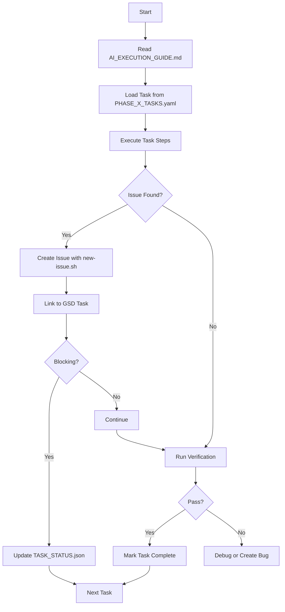

# Complete System Overview: GSD + Beads

## What You Have Now

This repo contains a complete development workflow system combining:

1. **GSD (Get Shit Done)** - AI-optimized task execution methodology
2. **Beads (`bd`)** - Issue tracking, dependencies, and work state management

## Directory Structure

```
/Users/bretbouchard/apps/local_intelligence_mcp/

docs/
├── gsd/                                    # GSD Methodology
│   ├── MASTER_PLAN.md                     Overall vision
│   ├── PHASES_AND_PLANS.md                Phase descriptions
│   ├── ACCEPTANCE_GATES.md                Quality gates
│   ├── TEST_STRATEGY.md                   Testing requirements
│   └── tasks/                             AI-optimized task breakdown
│       ├── README.md                      Quick start
│       ├── INDEX.md                       Navigation
│       ├── AI_EXECUTION_GUIDE.md          ⭐ AI START HERE
│       ├── TASK_TEMPLATE.yaml             Task format
│       ├── PHASE_0_TASKS.yaml             28 tasks (2-3 days)
│       ├── PHASE_1_TASKS.yaml             42 tasks (3-4 days)
│       ├── PHASE_2_TASKS.yaml             32 tasks (2-3 days)
│       ├── PHASE_3_TASKS.yaml             48 tasks (4-5 days)
│       └── PHASES_4_5_6_TASKS.yaml        65 tasks (deferred)
│
├── GSD_BEADS_INTEGRATION.md               How GSD + Beads work together
└── SYSTEM_OVERVIEW.md                     This file

.beads/                                     # Beads Work Tracking
├── local_intelligence_mcp.db              SQLite database
├── issues.jsonl                           Issue journal
└── bd.sock                                Daemon socket
```

## Workflow Integration

### For AI Agent (Qwen3-Code:30B)



### Task Execution with Issue Tracking

```bash
# AI executes GSD task
cd /Users/bretbouchard/apps/local_intelligence_mcp

# 1. Read task definition
cat docs/gsd/tasks/PHASE_0_TASKS.yaml | grep -A 50 "task_id: \"0.1.1\""

# 2. Execute work steps
# ... implementation ...

# 3. Run verification
swift build
swift test --filter ToolInventoryTests

# 4. Issue found during verification?
./scripts/new-issue.sh bug "Tool registry test fails on macOS 13"

# Edit the created file
vim docs/tracking/bugs/BUG-20260822-001-tool-registry-test-fails.md

# 5. Link to task
# In bug file: "Linked Items: GSD Task 0.1.1"

# 6. Update status
jq '.tasks["0.1.1"] = {
  "status": "blocked",
  "blocked_by": "BUG-20260822-001",
  "timestamp": "'$(date -u +%Y-%m-%dT%H:%M:%SZ)'"
}' TASK_STATUS.json > tmp.json && mv tmp.json TASK_STATUS.json

# 7. Fix bug or move to next task
```

## File Relationships

```
PHASE_0_TASKS.yaml (task 0.1.1)
    ↓
TASK_STATUS.json {"0.1.1": {"status": "blocked"}}
    ↓
BUG-20260822-001-tool-registry.md
    ↓
TASK_STATUS.json {"blocked_by": "BUG-20260822-001"}
    ↓
Fix bug → Update status → Mark resolved
    ↓
Continue with task 0.1.2
```

## Priority Integration

### GSD Task Priorities

- **Priority 1**: Critical path, must complete
- **Priority 2**: Important, should complete
- **Priority 3**: Optional, can defer

### Issue Priorities

- **P0-critical**: Blocks release/phase
- **P1-high**: Address in current phase
- **P2-medium**: Next phase acceptable
- **P3-low**: Backlog

### Mapping

```
GSD Priority 1 task blocked → Issue P0 or P1
GSD Priority 2 task blocked → Issue P1 or P2
Enhancement idea → Issue P2 or P3
Design decision → Note P2
```

## Common Scenarios

### Scenario 1: Bug Found During Task

```bash
# AI executing task 2.3.2
# Test fails

./scripts/new-issue.sh bug "Shortcuts timeout hardcoded at 5s"

# Edit file:
# - Set Priority: P1-high (blocks task completion)
# - Link to GSD Task: 2.3.2
# - Propose fix

# Update TASK_STATUS.json
# Decision: Fix now (small change) or defer (complex)
```

### Scenario 2: Feature Idea Emerges

```bash
# AI working on Phase 3
# Realizes streaming would be beneficial

./scripts/new-issue.sh feature "Streaming generation support"

# Edit file:
# - Set Priority: P2-medium (enhancement, not required)
# - Link to GSD Phase: 4 (deferred)
# - Estimate: 6-8 tasks

# Continue with current phase
```

### Scenario 3: Important Decision

```bash
# AI encounters API uncertainty

./scripts/new-issue.sh note "Apple FM API documentation needed"

# Edit file:
# - Set Priority: P0-critical
# - Document hallucination risk
# - BLOCK Phase 3
# - Assign: human

# Update TASK_STATUS.json to block all Phase 3 tasks
```

## Quick Reference

### AI Commands

```bash
# Start new phase
cat docs/gsd/tasks/AI_EXECUTION_GUIDE.md

# Load task
cat docs/gsd/tasks/PHASE_0_TASKS.yaml | grep -A 50 "task_id: \"0.1.1\""

# Create issue
./scripts/new-issue.sh [bug|feature|note] "Description"

# List issues
grep -r "Status: open" docs/tracking/

# Update task status
jq '.tasks["0.1.1"] = {"status": "complete"}' TASK_STATUS.json > tmp && mv tmp TASK_STATUS.json
```

### Human Commands

```bash
# Review progress
cat TASK_STATUS.json | jq '.overall_completion'

# Check blockers
grep -r "Status: blocked" TASK_STATUS.json

# Review critical issues
grep -r "Priority: P0" docs/tracking/

# Complete human tasks (like 3.0.1)
# Research Apple API → create docs/ai_context/foundation_models_api.md
```

## Success Metrics

Track these across both systems:

```bash
# GSD Progress
jq '.overall_completion' TASK_STATUS.json

# Issue Velocity
find docs/tracking -name "*.md" -exec grep -l "Status: resolved" {} \; | wc -l

# Current Blockers
grep -r "blocked_by" TASK_STATUS.json | wc -l

# Open Critical Issues
grep -r "Priority: P0" docs/tracking/ | grep "Status: open" | wc -l
```

## Next Steps

1. **AI**: Read `docs/gsd/tasks/AI_EXECUTION_GUIDE.md`
2. **AI**: Start with task 0.1.1 in `PHASE_0_TASKS.yaml`
3. **Human**: Monitor `TASK_STATUS.json` daily
4. **Human**: Complete task 3.0.1 before Phase 3
5. **Both**: Use `./scripts/new-issue.sh` for all issues

## Benefits of Integrated System

✅ **Traceability**: Issues → Tasks → Code → Commits  
✅ **Transparency**: All work visible and trackable  
✅ **Flexibility**: Can track locally or use GitHub  
✅ **AI-Friendly**: Clear structure, simple tools  
✅ **Version-Controlled**: Everything in git  
✅ **Searchable**: Grep/jq friendly  
✅ **Maintainable**: Plain markdown + JSON  

---

**Total System**:
- 215 GSD tasks
- Issue tracking for bugs/features/notes
- Complete integration
- Ready for AI execution

**Start**: `docs/gsd/tasks/AI_EXECUTION_GUIDE.md`
