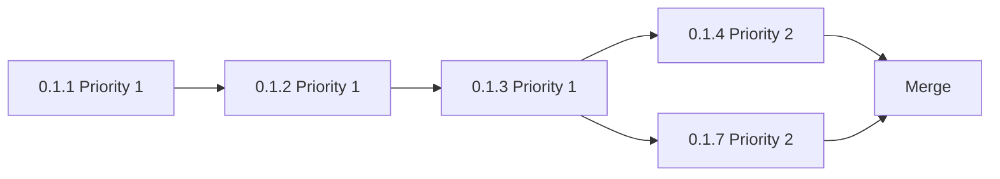

# AI-Optimized Task Execution Guide for Qwen3-Code:30B

## Overview

This guide orchestrates the AI-driven implementation of Local Intelligence MCP vNext across 6 phases and 195+ atomic tasks.

## Task Breakdown Summary

| Phase | Focus | Tasks | Est. Time | Priority | Status |
|-------|-------|-------|-----------|----------|--------|
| 0 | Establish Truth | 28 | 2-3 days | CRITICAL | Ready |
| 1 | Capability Kernel | 42 | 3-4 days | CRITICAL | Ready |
| 2 | Real Automation | 32 | 2-3 days | CRITICAL | Ready |
| 3 | macOS 15 FM | 48 | 4-5 days | CRITICAL | Blocked* |
| 4 | macOS 16+ | 28 | 3-4 days | DEFERRED | Not Ready |
| 5 | Hardening | 22 | 2-3 days | DEFERRED | Not Ready |
| 6 | Public Surface | 15 | 1-2 days | PARALLEL | Partial |
| **Total** | | **215** | **17-24 days** | | |

\* Phase 3 blocked on task 3.0.1 (Apple API documentation extraction)

## Quick Start for AI Agent

### Step 1: Initialize Environment

```bash
cd /Users/bretbouchard/apps/local_intelligence_mcp

# Verify baseline
swift build
swift test

# Create status tracking
cat > TASK_STATUS.json << 'EOF'
{
  "current_phase": 0,
  "current_task": "0.1.1",
  "overall_completion": 0,
  "tasks": {}
}
EOF
```

### Step 2: Load Task Definition

```bash
# AI should read this before starting each task
cat docs/gsd/tasks/TASK_TEMPLATE.yaml
cat docs/gsd/tasks/PHASE_0_TASKS.yaml
```

### Step 3: Execute First Task

```yaml
task_id: "0.1.1"
name: "Enumerate all registered MCP tools"
# Read full task definition from PHASE_0_TASKS.yaml
# Follow work steps exactly
# Run verification commands
# Update TASK_STATUS.json
# Commit with message: "feat(inventory): enumerate MCP tools [task 0.1.1]"
```

## Task Execution Protocol

### For Each Task

1. **Read Task Definition**
   - Load from appropriate PHASE_X_TASKS.yaml
   - Check dependencies completed
   - Check preconditions met

2. **Review AI Context**
   - If task references docs/ai_context/, read those files first
   - If API knowledge needed, check for reference docs
   - If pattern needed, look for examples

3. **Execute Work Steps**
   - Follow steps in order
   - Use code_hints as guidance, not verbatim copying
   - Write tests DURING implementation, not after

4. **Run Verification**
   - Execute ALL verification commands
   - ALL must pass (exit code 0 or expected output)
   - If verification fails, debug before proceeding

5. **Check Acceptance Criteria**
   - Manually verify each criterion
   - Document any deviations

6. **Update Status**
   ```bash
   # Update TASK_STATUS.json
   jq '.tasks["0.1.1"] = {"status": "complete", "timestamp": "'$(date -u +%Y-%m-%dT%H:%M:%SZ)'"}' TASK_STATUS.json > tmp.json && mv tmp.json TASK_STATUS.json
   ```

7. **Commit Changes**
   ```bash
   git add -A
   git commit -m "feat(component): task description [task 0.1.1]"
   ```

### Compilation Checkpoints

Every 5 tasks OR at end of each plan:

```bash
# Full build check
swift build

# All tests must pass
swift test

# Lint check (if enabled)
swiftlint lint

# Commit checkpoint
git add -A
git commit -m "checkpoint: completed plan 0.1 [tasks 0.1.1-0.1.7]"
```

## Critical Dependencies

### Phase 0 → Phase 1

- Phase 0 must complete before Phase 1 starts
- CapabilityError (0.2.2) is used throughout Phase 1
- False-success removal (0.2.x) establishes baseline integrity

### Phase 1 → Phase 2

- CapabilityRouter (1.2.x) required for Phase 2 providers
- RuntimeCapabilities (1.1.x) required for availability checks
- Tool schemas (1.4.x) required for automation wiring

### Phase 2 → Phase 3

- Automation can proceed in parallel with early Phase 3
- Both should be complete before Phase 3 integration tests

### Phase 3 BLOCKER

⚠️ **CRITICAL**: Task 3.0.1 must be completed by human before AI starts Phase 3

```yaml
task_id: "3.0.1"
name: "Extract Apple Foundation Models API documentation"
assignee: HUMAN  # AI cannot do this reliably
estimated_time: "2 hours"
output:
  - docs/ai_context/foundation_models_api.md
  - docs/ai_context/foundation_models_examples.swift
```

**Why**: AI will hallucinate Foundation Models APIs if not given exact Apple documentation. This task requires:
- Access to Apple developer docs
- WWDC session notes
- Sample code from Apple
- Testing on macOS 15+ hardware

**AI should WAIT** until this file exists and contains working code examples before starting Phase 3.

## Parallel Execution Opportunities

Tasks marked `priority: 2` or `priority: 3` can execute in parallel with lower-priority tasks in the same plan:



## Error Handling

### If Verification Fails

1. **Review output carefully**
   - Compare expected vs actual
   - Check for typos in commands

2. **Debug the implementation**
   - Don't skip verification
   - Don't mark task complete

3. **Ask for clarification if stuck**
   - Document the issue
   - Update task status to "blocked"

### If Dependencies Missing

```json
{
  "tasks": {
    "0.1.2": {
      "status": "blocked",
      "blocked_by": "0.1.1",
      "reason": "Waiting for tool_registry.json"
    }
  }
}
```

### If API Unknown

If a task requires an API that isn't documented in docs/ai_context/:

1. Mark task status as "blocked"
2. Document missing information:
   ```json
   {
     "blocked_reason": "Missing API reference for Shortcuts execution",
     "needs_research": "docs/ai_context/shortcuts_api_reference.md"
   }
   ```
3. Request human to research API
4. DO NOT hallucinate the API

## Quality Gates

### Gate Enforcement

Before marking a phase complete:

1. **All priority 1 tasks complete**
2. **All verification commands pass**
3. **Full test suite passes** (`swift test`)
4. **No compiler warnings** (ideally)
5. **Documentation updated** (if phase includes docs tasks)

### Phase 0 Gate

- [ ] Tool registry generated (JSON exists)
- [ ] All simulated tools removed or return errors
- [ ] README audit shows no false claims
- [ ] Baseline metrics captured
- [ ] Build succeeds on macOS 13 SDK

### Phase 1 Gate

- [ ] RuntimeCapabilities reports real state
- [ ] CapabilityRouter routes to providers
- [ ] All local_* tools registered
- [ ] Error taxonomy complete
- [ ] Observability logging works

### Phase 2 Gate

- [ ] Real Shortcuts execution works (integration test)
- [ ] Timeout and cancellation work
- [ ] Permission checks enforced
- [ ] Automation documented

### Phase 3 Gate

- [ ] Generation works on eligible hardware OR gracefully unavailable
- [ ] Structured generation produces valid JSON
- [ ] Tool calling respects policy
- [ ] macOS 13-14 still functional
- [ ] All integration tests pass

## Progress Tracking

### Update TASK_STATUS.json After Each Task

```javascript
{
  "current_phase": 0,
  "current_plan": "0.1",
  "current_task": "0.1.3",
  "overall_completion": 1.4,  // (3 / 215) * 100
  "phase_completion": {
    "0": 10.7,  // (3 / 28) * 100
    "1": 0,
    "2": 0,
    "3": 0
  },
  "tasks": {
    "0.1.1": {"status": "complete", "duration_minutes": 18},
    "0.1.2": {"status": "complete", "duration_minutes": 25},
    "0.1.3": {"status": "in_progress", "started": "2026-08-22T21:30:00Z"}
  },
  "last_checkpoint": "2026-08-22T21:15:00Z",
  "last_commit": "abc123f"
}
```

### Daily Summary

At end of each work session, generate summary:

```bash
cat > docs/progress/daily_$(date +%Y%m%d).md << EOF
# Progress Report: $(date +%Y-%m-%d)

## Completed Today
- Task 0.1.1: Enumerate MCP tools (18 min)
- Task 0.1.2: Classify tools (25 min)
- Task 0.1.3: Map tool sources (23 min)

## Metrics
- Tasks completed: 3
- Tests added: 7
- Build status: ✅ Passing
- Test status: ✅ 100% pass

## Blockers
None

## Next Session
- Task 0.1.4: Map tools to tests
- Task 0.1.5: Extract build requirements
EOF
```

## Best Practices for AI Implementation

### DO

✅ Read entire task definition before starting
✅ Follow work steps in order
✅ Write tests alongside code
✅ Run verification after every change
✅ Commit frequently with task IDs
✅ Update TASK_STATUS.json
✅ Ask for help when blocked
✅ Use code_hints as guidance, adapt as needed

### DON'T

❌ Skip verification steps
❌ Mark task complete if verification fails
❌ Hallucinate APIs without reference docs
❌ Write code without tests
❌ Combine multiple tasks into one commit
❌ Proceed if dependencies not met
❌ Ignore acceptance criteria
❌ Copy code_hints verbatim without understanding

## Integration with Byterover MCP

After completing each phase:

```bash
# Store knowledge about patterns learned
echo "Completed Phase X: Key learnings..." | byterover-store-knowledge

# Before starting new phase, retrieve relevant context
byterover-retrieve-knowledge "Phase X implementation patterns"
```

## File Structure Reference

```
docs/gsd/
├── MASTER_PLAN.md              # Overall vision
├── PHASES_AND_PLANS.md         # Original plan descriptions
├── ACCEPTANCE_GATES.md         # Quality gates
├── TEST_STRATEGY.md            # Testing requirements
└── tasks/
    ├── TASK_TEMPLATE.yaml      # Task format
    ├── PHASE_0_TASKS.yaml      # 28 tasks
    ├── PHASE_1_TASKS.yaml      # 42 tasks
    ├── PHASE_2_TASKS.yaml      # 32 tasks
    ├── PHASE_3_TASKS.yaml      # 48 tasks
    └── PHASES_4_5_6_TASKS.yaml # 65 tasks (deferred)

docs/ai_context/
├── foundation_models_api.md    # Phase 3 PREREQUISITE
├── shortcuts_api_reference.md  # Phase 2
├── apple_intelligence_api_reference.md
├── swift_concurrency_patterns.md
├── mcp_tool_schema_examples.md
├── error_handling_patterns.md
└── testing_patterns.md

TASK_STATUS.json                # Current progress
```

## Execution Timeline

### Week 1: Foundation (Phases 0-1)

- **Days 1-2**: Phase 0 (Establish truth)
- **Days 3-5**: Phase 1 (Capability kernel)
- **Checkpoint**: RuntimeCapabilities + Router working

### Week 2: Implementation (Phases 2-3 start)

- **Days 1-2**: Phase 2 (Real automation)
- **Day 3**: Human completes task 3.0.1 (API docs)
- **Days 4-5**: Phase 3 start (Sessions + Basic generation)
- **Checkpoint**: Shortcuts working, FM skeleton exists

### Week 3: Core Completion (Phase 3 finish)

- **Days 1-3**: Phase 3 (Structured + Tools)
- **Days 4-5**: Phase 3 (Integration + Testing)
- **Checkpoint**: macOS 15 FM works on eligible hardware

### Week 4: Polish (Phases 5-6)

- **Days 1-2**: Phase 5 (Security + Compatibility)
- **Days 3-4**: Phase 6 (Documentation)
- **Day 5**: Release prep + evidence bundle

## Success Metrics

Track these across implementation:

- **Task completion rate**: % of tasks passing verification on first attempt (target: >80%)
- **Build continuity**: Days without breaking build (target: 100%)
- **Test growth**: New tests per phase (target: 50+ per phase)
- **Coverage**: Code coverage % (target: >85% for priority 1 paths)
- **False positives**: Tests incorrectly passing (target: 0)

## Getting Help

If AI agent gets stuck:

1. **Update TASK_STATUS.json** with "blocked" status
2. **Document the blocker** clearly
3. **Save current work** (commit or stash)
4. **Report**: "Task X.Y.Z blocked: <reason>"

Human reviewer can then:
- Provide missing context
- Clarify requirements
- Research unknown APIs
- Adjust task if needed

## Conclusion

This task breakdown transforms the conceptual GSD plans into executable AI-ready work units. Each task is:

- **Atomic**: 15-60 minute chunks
- **Verifiable**: Concrete pass/fail commands
- **Documented**: Context and examples provided
- **Tracked**: Status monitoring built in

**Start with**: `docs/gsd/tasks/PHASE_0_TASKS.yaml`, task 0.1.1

**Next steps after Phase 0**: Review gate checklist, proceed to Phase 1

**Remember**: Quality > Speed. A task isn't done until verification passes.
